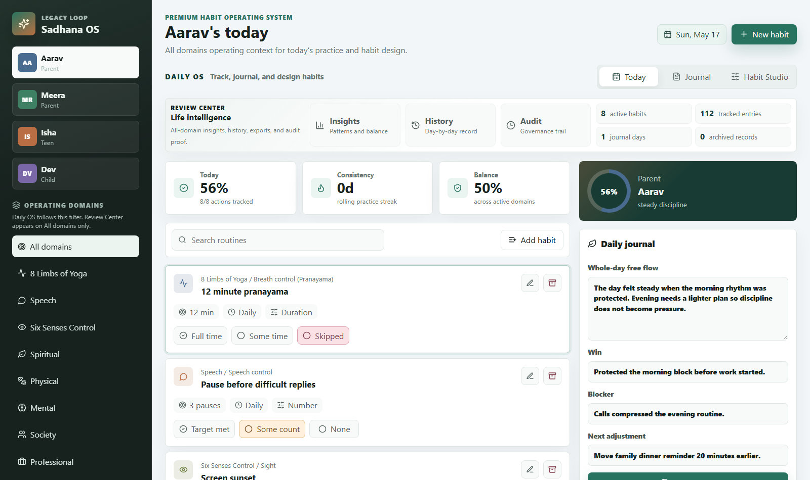

# Sankalp OS

**A premium personal and family life operating system for turning intentions into consistent daily action.**

Sankalp OS is a hackathon-ready browser app, currently branded in-product as **Sadhana OS by Legacy Loop**, built for people who want more than a streak counter. It helps individuals and families define life domains, design SMART habits, track daily practice, preserve history, review patterns, journal honestly, and maintain an auditable record of change over time.



## Why It Exists

Most habit apps are narrow: they track checklists, fitness streaks, or simple daily goals. Real life is broader. Spiritual practice, speech discipline, health, family responsibility, professional growth, learning, emotional regulation, and service all need a shared system.

Sankalp OS treats life as an operating system:

- **Daily OS** for action, tracking, journaling, and habit design.
- **Review Center** for insights, history, exports, archive visibility, and audit proof.
- **Habit Studio** for evolving categories, sub-components, and SMART criteria without losing historical context.

## Product Highlights

- **Family profiles** with sample members and personalized routines.
- **Life domains** across 8 Limbs of Yoga, Speech, Six Senses Control, Spiritual, Physical, Mental, Society, Professional, and Family.
- **Custom habits** with category, sub-component, tracking type, frequency, target, unit, success criteria, and SMART card.
- **Multiple tracking types** including completion, numeric, duration, checklist, and reflection habits.
- **Whole-day journaling** plus habit-specific journal notes.
- **Review windows** for 30 days, 90 days, 1 year, 5 years, or a custom number of days.
- **Insights dashboard** for domain balance, habit consistency, recent rhythm, review signals, and family/member progress.
- **Professional history view** grouped by day, showing habit status, values, notes, daily journal, and archived records.
- **Archive-first governance** for domains, habits, and sub-components. Nothing important is hard-deleted.
- **Audit trail** for tracking changes, journal saves, habit edits, archives, restores, and demo initialization.
- **Export support** for a visual HTML report and full JSON data export.
- **Local-first demo** with browser storage and no backend dependency.

## Demo Flow

1. Open the app and review the **Daily OS** dashboard.
2. Track a few habits using type-aware buttons such as `Full time`, `Some count`, or `Reflected`.
3. Add a habit-specific note in the SMART card.
4. Save a whole-day journal entry.
5. Open **Habit Studio** to add, edit, archive, or restore domains, sub-components, and habits.
6. Open **Review Center** to inspect Insights, History, and Audit.
7. Export a visual report from History.
8. Use **Reset demo** to restore seeded sample data.

## Tech Stack

### Frontend

- **React 19** for the interactive application UI.
- **React DOM 19** for browser rendering.
- **Vite 7** for local development, bundling, and production build.
- **JavaScript / JSX** for app logic and component structure.
- **CSS3** with custom properties, responsive grid/flex layouts, and handcrafted premium UI styling.
- **Lucide React** for clean, consistent interface icons.

### Data and State

- **Browser localStorage** for local-first persistence.
- **Seeded demo data** for family members, life domains, SMART habits, historical entries, reflections, and audit records.
- **Client-side data model** for:
  - members
  - categories/domains
  - sub-components
  - habits
  - tracking entries
  - daily reflections
  - audit events
  - archived records

### Tooling

- **npm** for package management and scripts.
- **Vite build pipeline** for production assets.
- **Git / GitHub** for source control and repository hosting.

### Runtime Characteristics

- No backend.
- No database server.
- No authentication layer.
- No external API required for the current demo.
- Runs entirely in the browser once loaded.

## Getting Started

```bash
npm install
npm run dev
```

Then open:

```text
http://127.0.0.1:5173/
```

## Available Scripts

```bash
npm run dev
```

Starts the Vite development server.

```bash
npm run build
```

Builds the production-ready static app into `dist/`.

```bash
npm run preview
```

Serves the production build locally for verification.

## Project Structure

```text
Sankalp-OS/
|-- index.html
|-- package.json
|-- package-lock.json
|-- src/
|   |-- App.jsx
|   |-- main.jsx
|   `-- styles.css
|-- docs/
|   `-- sankalp-os-dashboard.png
`-- README.md
```

## Current Scope

This repository contains a polished hackathon MVP designed to demonstrate business value, product craft, and a strong demo narrative within a local browser app.

The current version focuses on:

- premium UX
- habit tracking
- family routines
- journaling
- historical review
- archive governance
- auditability
- exportable proof

## Future Direction

Sankalp OS can grow into a subscription-grade life platform with:

- accounts and secure sync
- reminders and calendar integration
- AI-assisted coaching
- guided frameworks such as Atomic Habits and The 7 Habits
- family plans
- long-term analytics
- mobile app support
- private cloud backup
- wearable and health integrations

## Repository

GitHub: [usermanoj/Sankalp-OS](https://github.com/usermanoj/Sankalp-OS)
